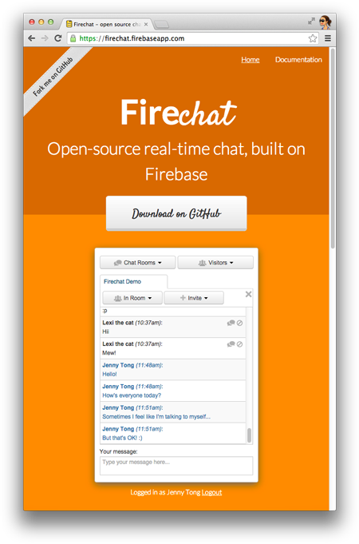

# Firechat

[](http://badge.fury.io/gh/firebase%2Ffirechat)

Firechat is a simple, extensible chat widget powered by [Firebase](https://firebase.google.com/?utm_source=firechat).
It is intended to serve as a concise, documented foundation for chat products built on Firebase.
It works out of the box, and is easily extended.

## Live Demo

Visit [firechat.firebaseapp.com](https://firechat.firebaseapp.com/) to see a live demo of Firechat.

[](https://firechat.firebaseapp.com/)

## Setup

Firechat uses [Firebase](https://firebase.google.com/) as a backend, so it requires no server-side
code. It can be added to any web app by including a few JavaScript files

```HTML
<!-- jQuery -->
<script src='https://cdnjs.cloudflare.com/ajax/libs/jquery/2.1.1/jquery.min.js'></script>

<!-- Firebase -->
<script src="https://www.gstatic.com/firebasejs/3.0.0/firebase.js"></script>

<!-- Firechat -->
<link rel='stylesheet' href='https://cdn.firebase.com/libs/firechat/2.0.2/firechat.min.css' />
<script src='https://cdn.firebase.com/libs/firechat/2.0.2/firechat.min.js'></script>
```

and initializing the chat.

```HTML
<script>
function initChat(authData) {
  var chat = new FirechatUI(chatRef, document.getElementById('firechat-wrapper'));
  chat.setUser(authData.uid, authData[authData.provider].displayName);
}
</script>

<div id='firechat-wrapper'></div>
```

For detailed integration instructions, see the [Firechat documentation](https://firechat.firebaseapp.com/docs/).

## Getting Started with Firebase

Firechat requires Firebase in order to store data. You can
[sign up here](https://firebase.google.com) for a free account.

## Getting Help

If you have a question about Firechat, search the
[Firebase tag on Stack Overflow](http://stackoverflow.com/questions/tagged/firebase) to see if it has already been
answered. If it hasn't been asked, post a [new question](http://stackoverflow.com/questions/ask?tags=firebase+firechat).
We keep a close eye on those tags, and will answer your question soon.
